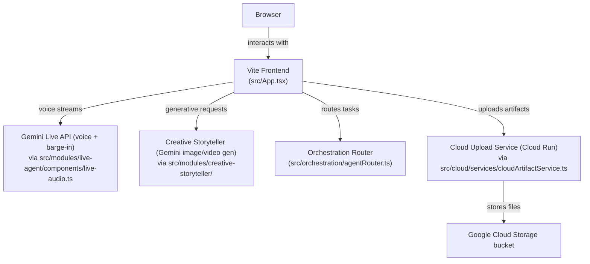

# Architecture

The integrated app uses ORB Live Agent as the primary shell and routes multimodal generation tasks to Creative Storyteller.

## Layers

- `shell`: App layout and workflow/status presentation.
- `modules/live-agent`: Realtime audio interaction and ORB visuals.
- `modules/creative-storyteller`: Image/video generation module.
- `orchestration`: Routing, workflow states, task and artifact coordination.
- `modules/ui-navigator/placeholder`: Reserved extension slot for future implementation.

## Architecture Diagram

