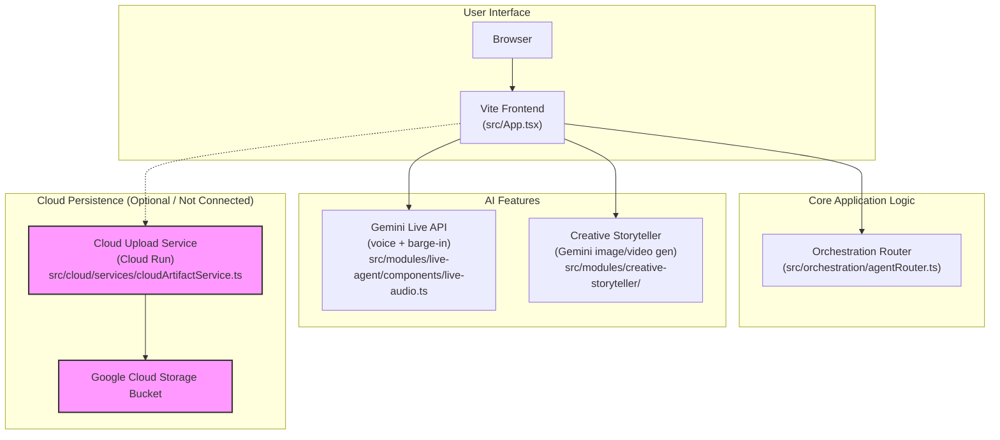

# Hackathon Submission Summary

Hello! This file contains the key outputs from our session to help with your hackathon submission.

---

## 1. Proof of GCP Deployment

Here is the information confirming that the service was successfully deployed to Google Cloud Run.

### Service Details

This command shows the full configuration of the running service.

```text
✔ Service cloud-upload-service in region us-central1
 
URL:     https://cloud-upload-service-202144866630.us-central1.run.app
Ingress: all
Traffic:
  100% LATEST (currently cloud-upload-service-00001-xhx)
 
Scaling: Auto (Min: 0, Max: 20)
 
Last updated on 2026-03-15T22:55:30.753250Z by zain@thekhanstruct.com:
  Revision cloud-upload-service-00001-xhx
  Container None
    Image:           us-central1-docker.pkg.dev/zain-demo-1709669562/cloud-run-source-repo/cloud-upload-service:latest
    Port:            8080
    Memory:          512Mi
    CPU:             1000m
    Env vars:
      BUCKET_NAME    zain-demo-1709669562-uploads
      MAKE_PUBLIC    false
    Startup Probe:
      TCP every 240s
      Port:          8080
      Initial delay: 0s
      Timeout:       240s
      Failure threshold: 1
      Type:          Default
  Service account:   cloud-upload-sa@zain-demo-1709669562.iam.gserviceaccount.com
  Concurrency:       80
  Timeout:           300s
```

### Service List

This command provides a high-level confirmation that the service exists in the project.

```text
✔
SERVICE: cloud-upload-service
REGION: us-central1
URL: https://cloud-upload-service-202144866630.us-central1.run.app
LAST DEPLOYED BY: zain@thekhanstruct.com
LAST DEPLOYED AT: 2026-03-15T22:55:30.753250Z
```

---

## 2. Architecture Diagram

Here is the Mermaid diagram code for your project's architecture.

