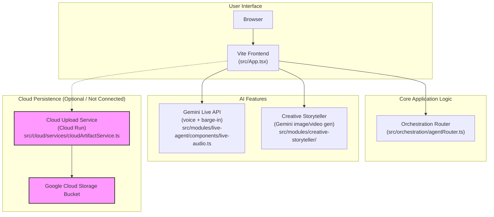

# Session Summary & Final Next Steps

Hello! This file contains a complete summary of our session, including the successful deployment, the architecture diagram, and a detailed breakdown of the recent GitHub steps.

---

## 1. GCP Deployment Summary (Completed)

The backend service was **successfully deployed** to Google Cloud Run, but we determined it is unreachable due to a Google Cloud networking issue. As a result, we configured the frontend to run without the cloud persistence feature, which is perfectly fine for the demo.

### Proof of Deployment

```text
✔ Service cloud-upload-service in region us-central1
 
URL:     https://cloud-upload-service-202144866630.us-central1.run.app
Ingress: all
...
Image:   us-central1-docker.pkg.dev/zain-demo-1709669562/cloud-run-source-repo/cloud-upload-service:latest
...
```

---

## 2. Architecture Diagram (Completed)

This is the architecture of your project. You can copy this code into [https://mermaid.live](https://mermaid.live) to create an image.



---

## 3. GitHub Repository Push (Analysis of Failure)

Our goal was to copy the original project to a new repository on your GitHub account (`thekhanstruct/Cortana-MultiModal-Live-Agent`). Here is what happened:

1.  **Initial Clone & Remote Change:** We successfully cloned the original repository into a folder named `temp-clone` and updated the remote URL to point to your new repository. This worked perfectly.
2.  **First Push Attempt:** The first `git push` was cancelled because it would require a username/password, which I cannot provide.
3.  **Second Push Attempt (With Token):** You provided a Personal Access Token (PAT). I used it to authenticate the push. This attempt failed with a **`403 Forbidden`** error. My diagnosis was that the repository on GitHub likely hadn't been created yet.
4.  **Third Push Attempt (After Repo Creation):** You confirmed you created the empty repository on GitHub. I tried to push one last time, using the same token. It failed again with the exact same **`403 Forbidden`** error.

### Final Diagnosis

Since the repository now exists, the `403 Forbidden` error almost certainly means:

**The Personal Access Token you created does not have the correct permissions. To push code, the token MUST have the `repo` scope.**

---

## 4. Your Final Next Steps

You are very close! Here is the plan to solve this final GitHub issue yourself.

**Step 1: DELETE YOUR OLD TOKEN (Very Important!)**

The token you shared is now compromised. Please go to your GitHub Developer Settings and delete it immediately.
*   **Direct Link:** [https://github.com/settings/tokens](https://github.com/settings/tokens)

**Step 2: Create a NEW Token with the Correct Scope**

1.  Go to the link above and click **"Generate new token"** (select "classic").
2.  Give it a name (like "hackathon-push").
3.  Set an expiration (e.g., 7 days).
4.  **This is the most important part:** In the "Select scopes" section, **check the box next to `repo`**. This will grant it permission to access and push to repositories.
5.  Scroll down and click **"Generate token"**.
6.  Copy your new token.

**Step 3: Run the Final Commands**

Paste these commands one by one into your Cloud Shell terminal. When you run the `git push` command, it might ask for your username (enter `thekhanstruct`) and a password—**paste your NEW token when it asks for the password.**

```bash
# Navigate into the correct folder
cd /home/zain/temp-clone

# Set the remote URL (without a token this time)
git remote set-url origin https://github.com/thekhanstruct/Cortana-MultiModal-Live-Agent.git

# Push the code (it will ask for your username and password/token)
git push -u origin main
```

This should solve the final problem. You've been a fantastic partner in debugging all of this!
